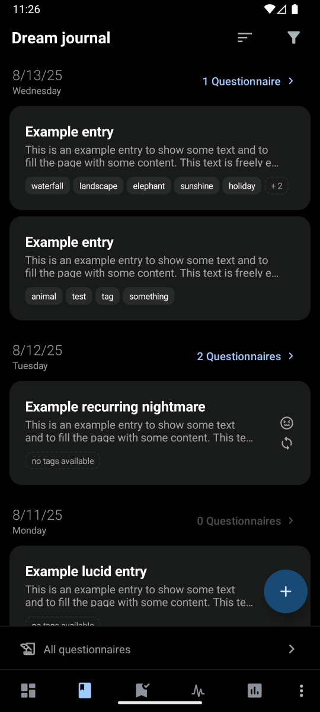
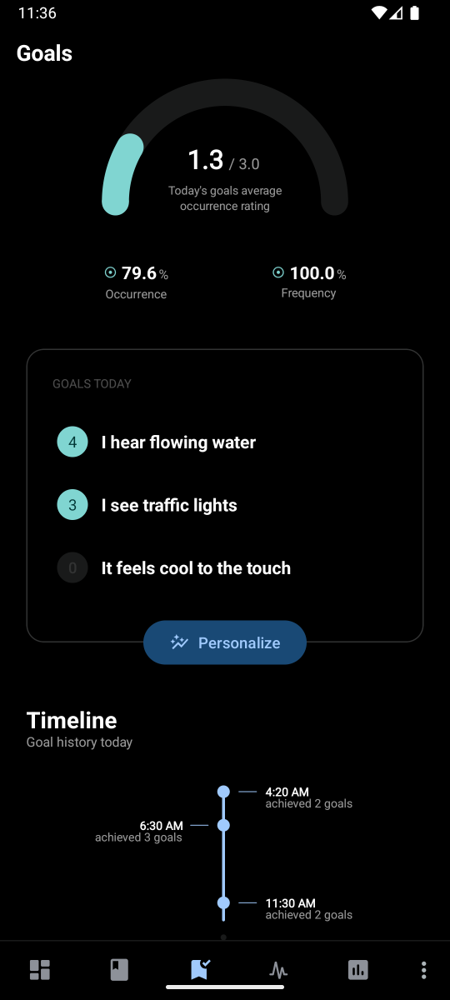
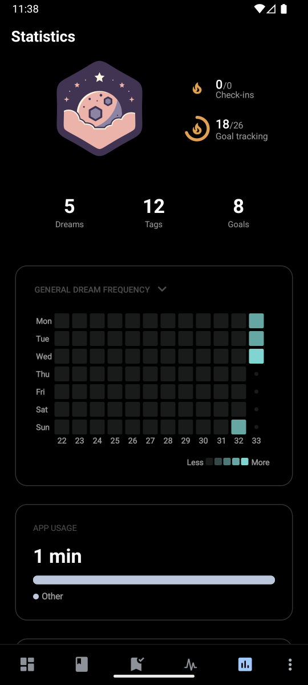

#  LucidSourceKit

**LucidSourceKit** is supposed to be an all-you-need toolkit for lucid dreaming with a focus on feature richness and customizability. The main idea is to store all your data on your phone where you have full control over it. In addition to that, an ad-free experience and a modern UI while providing powerful tools are some of the primary goals.

### Main features
* Password / PIN / Biometric app protection
* Dream Journal (Audio, Text, Template)
* Questionnaires
* Prospective memory trainer (Goals)
* Binaural Beats
* Notifications
* Alarms
* Statistics
* Backup / Export
* Customizability

 

## 🛡️ Privacy
As stated above, it is being tried to keep all your data on your phone exclusively for as long as you do not export it. Everything is saved locally (unencrypted) on the phone in the applications data directory (which should only be accessible by this app on non-rooted devices). The app does not have the permission `android.permission.INTERNET`. Therefore it cannot directly connect to the internet. Exceptions would be data automatically processed by Android devices and other data transfers that I am not aware of. If you notice any kind of privacy issues, feel free to report it in the [Issues](https://github.com/BitFlaker/lucidsourcekit/issues) section.

## ⚠️ Disclaimer
I (the developer of this app) am not a scientist, doctor or similar. I am just a programmer who maintains this app as a hobby because it is the app I wish existed. This means it is possible that some features of the app do not work as they should (due to lack of scientific knowledge or similar).

This application is not intended for medical treatment. The application could contain errors, bugs or vulnerabilities which could lead to unexpected or undesireable consequences. If you encounter such problems, feel free to report them in the [issues](https://github.com/BitFlaker/lucidsourcekit/issues) section. Keep in mind that this application still is in a very early development stage and not considered stable yet. The app contains a binaural beats generator that outputs frequencies trying to replicate brain wave cycles. By listening to these binaural beats, your state of consciousness will be altered. Due to the strong and repetitive pulsating rhythms, chilldren and people who are prone to seizures, epilepsy, suffer from mental illnesses or are pregnant are strongly advised not to use this binaural beats generator. I recommend you to seek professional medical advice before use of this app.
Use the app at your own risk.

> [!NOTE]
> The code quaility is not great at the moment and requires a lot of refactoring which will be done piece by piece in the future.

## 🚀 Installation
An official release APK download is available on the Releases page [here](https://github.com/BitFlaker/lucidsourcekit/releases). 
For development, you can build it yourself by first cloning this repository and then using the "Import Project" option in [Android Studio](https://developer.android.com/studio?hl=de). Then you can debug the app and also export the project as an `apk` file to install it on your phone. \
This application requires an Android device with **at least Android 7.0 (Nougat)** or newer.

## 🎯 Issues
There is a list of known issues [here](https://github.com/BitFlaker/lucidsourcekit/issues) (bugs, feature suggestions and other issues).\
In case you found a bug or have a new idea/feature for the application, feel free to create a new issue [here](https://github.com/BitFlaker/lucidsourcekit/issues/new).

#### Currently known issues
* There are some performance issues on older devices
* The app does not support light mode
* Some buttons / features are still placeholders (like automatic goal difficulty adjustment)
* Settings and customizations are not yet available

## 🌐 Language support
| Language | Translated |
|----------|------------|
| English  | 100%       |
| German   | TBD        |

## 💫 Like this project?
If you like this app, consider giving this repository a star ⭐

## 📜 License
This application is licensed under the [GNU General Public License v3.0](https://choosealicense.com/licenses/gpl-3.0/).
